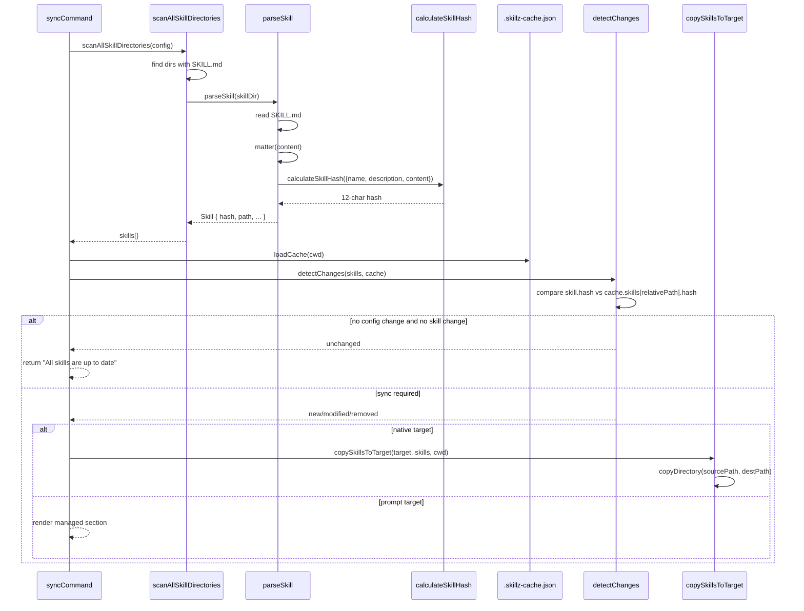

# Skill Hash Calculation Flow

Last updated: 2026-03-08

## Purpose / Question Answered

This flow documents how `skillz sync` decides whether a skill has changed. It answers the main question directly: no, the current per-skill hash does not hash every file in a skill directory. It hashes only the parsed `SKILL.md` values `name`, `description`, and trimmed markdown body content, then compares that hash against the cached value before any target sync runs (`src/core/skill-parser.ts:11`, `src/utils/hash.ts:8`, `src/core/change-detector.ts:7`).

## Entry points

- `src/commands/sync.ts:30`: `syncCommand(options, context)`
- `src/core/skill-scanner.ts:50`: `scanAllSkillDirectories(config)`
- `src/core/skill-parser.ts:11`: `parseSkill(skillPath)`
- `src/utils/hash.ts:8`: `calculateSkillHash(skill)`

## Call path

### Phase 1: Discover candidate skill directories

Trigger / entry condition:
- `skillz sync` starts and loads config successfully.

Entrypoints:
- `src/commands/sync.ts:30` via `syncCommand(...)`
- `src/core/skill-scanner.ts:50` via `scanAllSkillDirectories(config)`

Ordered call path:
- `syncCommand` calls `scanAllSkillDirectories(config)` after validating sync options (`src/commands/sync.ts:95-98`).
- `scanAllSkillDirectories` expands `config.skillDirectories` plus `config.additionalSkills` into `directoryEntries` (`src/core/skill-scanner.ts:51-54`).
- For each configured entry, it either:
  - treats the configured path itself as the skill root when `syncFromRoot` is enabled (`src/core/skill-scanner.ts:66-73`), or
  - enumerates subdirectories with `scanDirectory(...)` (`src/core/skill-scanner.ts:73-75`).
- `scanDirectory` only returns subdirectories whose basename is not ignored and whose directory contains `SKILL.md` (`src/core/skill-scanner.ts:11-45`).

State transitions / outputs:
- Input: loaded `config`
- Output: a list of candidate skill directories, each defined by the presence of `SKILL.md`

Branch points:
- `entry.syncFromRoot`: switches between single-root parsing and subdirectory scanning.
- `ignore` / `entry.ignore`: skips matching directory basenames before parsing.
- Missing configured root: returns no candidates for that root instead of failing the scan (`src/core/skill-scanner.ts:14-17`).

External boundaries:
- Filesystem reads only; no HTTP/RPC boundaries identified.

#### Sudocode (Phase 1: Discover candidate skill directories)

```ts
// Source: src/commands/sync.ts
skills := scanAllSkillDirectories(config)

// Source: src/core/skill-scanner.ts
directoryEntries := [...config.skillDirectories, ...config.additionalSkills as localPath entries]

for entry in directoryEntries
  resolvedSkillDir := path.resolve(resolveHome(entry.localPath))
  ignorePatterns := [...config.ignore, ...(entry.ignore ?? [])] with duplicates removed

  if entry.syncFromRoot
    if !isSkillDirectory(resolvedSkillDir)
      throw Error('Skill directory does not contain SKILL.md')
    skillDirs := [resolvedSkillDir]
  else
    skillDirs := scanDirectory(entry.localPath, ignorePatterns) {
      resolvedDir := path.resolve(resolveHome(directory))
      if !fileExists(resolvedDir)
        return []

      subdirs := readDirectories(resolvedDir)
      return subdirs where !minimatch(path.basename(subdir), ignorePatterns)
        and isSkillDirectory(subdir)
    }
```

### Phase 2: Parse `SKILL.md` and compute the per-skill hash

Trigger / entry condition:
- `scanAllSkillDirectories` has a candidate `skillDir` to parse.

Entrypoints:
- `src/core/skill-scanner.ts:79` via `parseSkill(skillDir)`
- `src/core/skill-parser.ts:11` via `parseSkill(skillPath)`
- `src/utils/hash.ts:8` via `calculateSkillHash(skill)`

Ordered call path:
- `parseSkill` resolves `<skillDir>/SKILL.md` and reads that file only (`src/core/skill-parser.ts:12-18`).
- `gray-matter` splits the file into `frontmatter` and markdown `body` (`src/core/skill-parser.ts:20-21`).
- `validateSkillFrontmatter` validates the parsed metadata (`src/core/skill-parser.ts:23-29`).
- `parseSkill` builds a `Skill` object with:
  - `name` from frontmatter,
  - `description` from frontmatter,
  - `content` from `body.trim()`,
  - `lastModified` from `SKILL.md` file stats (`src/core/skill-parser.ts:31-46`).
- `calculateSkillHash` concatenates exactly ``${skill.name}:${skill.description}:${skill.content}`` and hashes that string with SHA-256, truncating to 12 hex chars (`src/utils/hash.ts:8-10`).
- `scanAllSkillDirectories` then adds scanner-derived metadata like `relativePath` and `sourceDirectory`, but those fields are not included in the hash input (`src/core/skill-scanner.ts:80-85`).

State transitions / outputs:
- Input: `skillDir`
- Output: `Skill` with `hash`, `name`, `description`, `content`, `path`, `relativePath`, and `sourceDirectory`

Branch points:
- Missing or unreadable `SKILL.md`: `parseSkill` throws and the scanner records a warning instead of returning a skill (`src/core/skill-parser.ts:16-18`, `src/core/skill-scanner.ts:113-115`).
- Invalid frontmatter: `parseSkill` throws before any hash is produced (`src/core/skill-parser.ts:23-29`).
- Duplicate skill names or include-filter misses are filtered after parsing, not during hash construction (`src/core/skill-scanner.ts:97-108`).

External boundaries:
- Filesystem reads only; no HTTP/RPC boundaries identified.

#### Sudocode (Phase 2: Parse `SKILL.md` and compute the per-skill hash)

```ts
// Source: src/core/skill-scanner.ts
skill := parseSkill(skillDir)
skill.relativePath := path.relative(resolvedSkillDir, skill.path) || path.basename(skill.path)
skill.sourceDirectory := entry.localPath

// Source: src/core/skill-parser.ts
function parseSkill(skillPath)
  resolvedSkillPath := path.resolve(skillPath)
  skillFile := path.join(resolvedSkillPath, 'SKILL.md')
  content := safeReadFile(skillFile)
  if !content
    throw Error(`SKILL.md not found at ${skillFile}`)

  frontmatter, body := matter(content)
  validateSkillFrontmatter(frontmatter)

  stats := getFileStats(skillFile)
  skill := {
    name: frontmatter.name,
    description: frontmatter.description,
    path: resolvedSkillPath,
    relativePath: '',
    sourceDirectory: '',
    content: body.trim(),
    frontmatter,
    lastModified: stats ? stats.mtime : new Date(),
    hash: '',
  }
  skill.hash := calculateSkillHash(skill)
  return skill

// Source: src/utils/hash.ts
function calculateSkillHash(skill)
  hashInput := `${skill.name}:${skill.description}:${skill.content}`
  return sha256(hashInput).slice(0, 12)
```

### Phase 3: Compare the new hash against cache and decide whether sync work is needed

Trigger / entry condition:
- `syncCommand` has a current `skills` list and has loaded `.skillz-cache.json`, if present.

Entrypoints:
- `src/commands/sync.ts:124` via the cached sync decision block
- `src/core/change-detector.ts:7` via `detectChanges(currentSkills, cache)`
- `src/core/cache-manager.ts:64` via `updateCache(skills, targetFile, config)`

Ordered call path:
- `syncCommand` loads cache from `.skillz-cache.json` (`src/core/cache-manager.ts:13-43`).
- If cache exists and `--force` is not set, `syncCommand` separately computes `currentConfigHash` from the whole config and compares it with `cache.configHash` (`src/commands/sync.ts:125-128`, `src/utils/hash.ts:31-34`).
- `detectChanges` compares each `skill.hash` against `cache.skills[skill.relativePath].hash` (`src/core/change-detector.ts:12-38`).
- If there is no cached entry for a `relativePath`, the skill is `new`; if the hash differs, it is `modified`; otherwise it is `unchanged` (`src/core/change-detector.ts:15-38`).
- If neither config nor skills changed, `syncCommand` exits early with `All skills are up to date` and does not touch prompt or native targets (`src/commands/sync.ts:134-137`).
- After a real sync completes, `updateCache` stores the current `skill.hash` values back into `.skillz-cache.json` (`src/core/cache-manager.ts:64-82`).

State transitions / outputs:
- Input: `skills`, optional `cache`, and loaded `config`
- Output: change classification per skill plus a decision to skip or continue syncing

Branch points:
- `options.force`: bypasses change detection and proceeds to sync (`src/commands/sync.ts:167-170`).
- `!cache`: treats the run as a full sync (`src/commands/sync.ts:167-168`).
- `!configChanged && !skillsChanged`: returns early with no target writes (`src/commands/sync.ts:134-137`).

External boundaries:
- Filesystem read/write of `.skillz-cache.json`; no HTTP/RPC boundaries identified.

#### Sudocode (Phase 3: Compare the new hash against cache and decide whether sync work is needed)

```ts
// Source: src/commands/sync.ts
cache := loadCache(cwd)

if !options.force and cache
  currentConfigHash := calculateConfigHash(config)
  configChanged := !hashesMatch(currentConfigHash, cache.configHash)

  changes := detectChanges(filteredSkills, cache)
  skillsChanged := hasChanges(changes)

  if !configChanged and !skillsChanged
    success('All skills are up to date')
    return

// Source: src/core/change-detector.ts
function detectChanges(currentSkills, cache)
  cachedSkillPaths := Set(Object.keys(cache.skills))

  for skill in currentSkills
    cachedEntry := cache.skills[skill.relativePath]

    if !cachedEntry
      changes.push({ skill, type: 'new', newHash: skill.hash })
    else if !hashesMatch(skill.hash, cachedEntry.hash)
      changes.push({
        skill,
        type: 'modified',
        oldHash: cachedEntry.hash,
        newHash: skill.hash,
      })
    else
      changes.push({
        skill,
        type: 'unchanged',
        oldHash: cachedEntry.hash,
        newHash: skill.hash,
      })

    cachedSkillPaths.delete(skill.relativePath)

  for removedPath in cachedSkillPaths
    changes.push({ skill: null, type: 'removed', oldHash: cache.skills[removedPath].hash })
```

### Phase 4: Copy the full skill directory after the hash decision (native sync only)

Trigger / entry condition:
- Change detection has decided sync should proceed, and at least one target resolves to native mode.

Entrypoints:
- `src/commands/sync.ts:205` native-target validation block
- `src/core/target-manager.ts:260` via `copySkillsToTarget(target, skills, cwd, cleanupSkills)`

Ordered call path:
- `syncCommand` validates native target conflicts before copying (`src/commands/sync.ts:205-210`, `src/core/target-manager.ts:215-255`).
- `copySkillsToTarget` resolves the destination directory, optionally removes stale skills, removes the existing destination directory for each skill, and then calls `copyDirectory(sourcePath, destPath)` (`src/core/target-manager.ts:260-291`).
- Because this copy step happens after change detection, extra files inside the skill directory are copied when a sync occurs, but those files do not participate in the earlier `skill.hash` comparison.

State transitions / outputs:
- Input: changed `skills` selected for sync and native-mode `target`
- Output: full directory copies under the native target

Branch points:
- `target.deleteExistingFromTarget`: removes stale copied skill directories before copying (`src/core/target-manager.ts:271-274`).
- If destination already exists for a managed skill, it is removed and recopied (`src/core/target-manager.ts:285-290`).

External boundaries:
- Filesystem directory copy only; no HTTP/RPC boundaries identified.

#### Sudocode (Phase 4: Copy the full skill directory after the hash decision)

```ts
// Source: src/core/target-manager.ts
function copySkillsToTarget(target, skills, cwd, cleanupSkills=skills)
  targetDir := resolveDirectoryPath(target.destination, cwd)
  ensureDir(targetDir)

  if target.deleteExistingFromTarget
    removeStaleSkillsFromTarget(targetDir, cleanupSkills)

  for skill in skills
    sourcePath := path.resolve(cwd, skill.path)
    destPath := path.join(targetDir, skill.name)

    if path.resolve(sourcePath) === path.resolve(destPath)
      continue

    if pathExists(destPath)
      fs.rm(destPath, { recursive: true, force: true })

    copyDirectory(sourcePath, destPath)
```

## State, config, and gates

### Core state values (source of truth and usage)

| Value | Source of truth | Representation | Initialization point | First consumer | Initialized before consuming context is captured? |
|---|---|---|---|---|---|
| `skillFile` | `<skillDir>/SKILL.md` on disk | absolute file path string | `parseSkill` builds it with `path.join(resolvedSkillPath, 'SKILL.md')` | `safeReadFile(skillFile)` and `getFileStats(skillFile)` | Yes |
| `frontmatter` | `gray-matter` parse of `SKILL.md` | object (`data`) | `matter(content)` in `parseSkill` | `validateSkillFrontmatter(frontmatter)` and `skill.name` / `skill.description` assignment | Yes |
| `body` / `skill.content` | markdown body of `SKILL.md` | trimmed string | `matter(content)` then `body.trim()` in `parseSkill` | `calculateSkillHash(skill)` | Yes |
| `skill.hash` | `calculateSkillHash(skill)` | 12-char SHA-256 hex prefix | after `Skill` object construction in `parseSkill` | `detectChanges(...)` and later `updateCache(...)` | Yes |
| `cache.skills[relativePath].hash` | `.skillz-cache.json` | cached hash string keyed by `relativePath` | `loadCache(cwd)` | `detectChanges(...)` | Yes |
| `configHash` | `calculateConfigHash(config)` | 12-char SHA-256 hex prefix of sorted-key JSON | in `syncCommand` or `updateCache(...)` | cache invalidation / config change detection | Yes |

Answer to the user’s question:
- No. The current skill hash does not walk the full skill directory.
- It hashes only `skill.name`, `skill.description`, and `skill.content`, where `skill.content` is the trimmed markdown body of `SKILL.md` (`src/utils/hash.ts:8-10`, `src/core/skill-parser.ts:20-21`, `src/core/skill-parser.ts:36-49`).
- Non-`SKILL.md` files can still be copied in native mode, but they do not currently affect the change-detection hash (`src/core/target-manager.ts:276-290`).

### Statsig (or `None identified`)

None identified.

### Environment Variables (or `None identified`)

None identified.

### Other User-Settable Inputs (or `None identified`)

| Name | Type | Where Read | Effect on Flow |
|---|---|---|---|
| `skillDirectories[].localPath` | config path | `src/core/skill-scanner.ts:60-75` | chooses which roots are scanned for skills |
| `additionalSkills[]` | config path list | `src/core/skill-scanner.ts:51-54` | adds extra roots to scan |
| `ignore` / `skillDirectories[].ignore` | config glob list | `src/core/skill-scanner.ts:64`, `src/core/skill-scanner.ts:25-37` | prunes candidate directories before parsing |
| `skillDirectories[].include` | config allowlist | `src/core/skill-scanner.ts:63`, `src/core/skill-scanner.ts:97-101` | filters parsed skills after hash calculation |
| `skillDirectories[].syncFromRoot` | config boolean | `src/core/skill-scanner.ts:66-73` | switches between parsing one root skill versus enumerating subdirectories |
| `options.only` | CLI list | `src/commands/sync.ts:112-121` | narrows which already-parsed skills are compared and synced |
| `options.force` | CLI boolean | `src/commands/sync.ts:124-170` | bypasses the early-return hash/cache short circuit |

### Important gates / branch controls

- `isSkillDirectory(subdir)`: a directory only enters the skill pipeline if it contains `SKILL.md` (`src/core/skill-scanner.ts:39-40`).
- `validateSkillFrontmatter(frontmatter)`: invalid metadata blocks hash production (`src/core/skill-parser.ts:23-29`).
- `hashesMatch(skill.hash, cachedEntry.hash)`: decides `modified` versus `unchanged` (`src/core/change-detector.ts:22-37`).
- `!configChanged && !skillsChanged`: returns before any target update happens (`src/commands/sync.ts:134-137`).
- `resolveTargetSyncMode(target, config) === 'native'`: determines whether the downstream work is prompt rendering or whole-directory copy (`src/commands/sync.ts:205-210`, `src/core/target-manager.ts:260-291`).

## Sequence diagram



## Observability

Metrics:
- None identified.

Logs:
- `debug("scanning all skill directories from ...")` when scanning begins (`src/core/skill-scanner.ts:58`).
- `debug("Found skill: ...")` for each parsed skill that survives validation and filters (`src/core/skill-scanner.ts:110-112`).
- `info("Changes detected: ...")` when cache/config comparison shows work to do (`src/commands/sync.ts:166`).
- `success("All skills are up to date")` when the hash/config checks short-circuit sync (`src/commands/sync.ts:135-137`).

Useful debug checkpoints:
- Put a breakpoint or temporary log in `parseSkill` after `matter(content)` to inspect the exact `name`, `description`, and `body.trim()` that feed the hash (`src/core/skill-parser.ts:20-49`).
- Inspect `.skillz-cache.json` after a sync to confirm which `relativePath` keys and hashes were persisted (`src/core/cache-manager.ts:64-82`).
- For native mode confusion, verify whether the observed change happened in `SKILL.md` or only in another copied file under the skill directory (`src/core/target-manager.ts:276-290`).

## Related docs

- `tests/integration/native-sync.test.ts:187-218`: covers re-copying when `SKILL.md` changes in native mode.
- `tests/integration/sync.test.ts:411-487`: covers config-hash caching and config-change detection.
- No existing local architecture or flow docs were present under `docs/flows/` when this document was created.

## Manual Notes 

[keep this for the user to add notes. do not change between edits]

## Changelog
- 2026-03-08: Created the initial flow doc for skill hash calculation and cache comparison behavior (019cce41-bbf0-7592-b86a-f8dcebd79b39)
