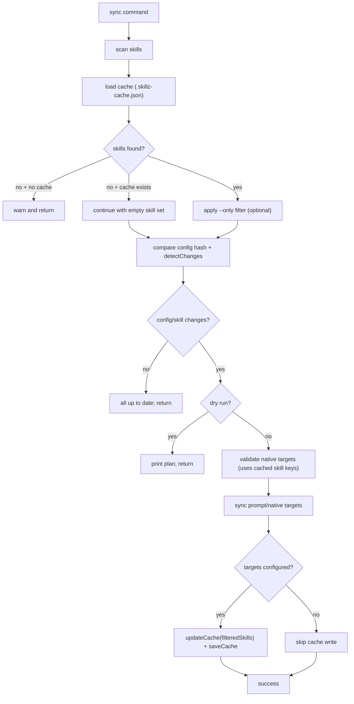

# Cache Flow

Last updated: 2026-02-16

Maintenance: When revising this doc you must follow instructions in
@shortcut:revise-flow-doc.md.

## Overview

Skillz caching tracks synced state in `.skillz-cache.json` so `sync` can:

- skip no-op sync runs,
- report new/modified/removed skills,
- allow safe overwrite checks in native mode,
- clear stale synced output when the discovered skill set becomes empty.

## Terminology

- **Cache file**: `.skillz-cache.json` in the Skillz project root.
- **Config hash**: hash of current `skillz.json` config used for change detection.
- **Skill hash**: hash of `name`, `description`, and `content` of each parsed skill.
- **Relative path key**: cache key for each skill entry (`skill.relativePath`).

## Cache Data Model

`src/types/index.ts` defines:

```text
CacheFile {
  version: string
  lastSync: ISO timestamp
  targetFile: string
  configHash: string
  skills: Record<relativePath, SkillCacheEntry>
}

SkillCacheEntry {
  hash: string
  path: string
  relativePath: string
  lastModified: ISO timestamp
}
```

**File(s)**: `src/types/index.ts`, `src/core/cache-manager.ts`

## Flow

### Load cache
- `src/core/cache-manager.ts`
```text
loadCache(cwd):
  if .skillz-cache.json does not exist -> return null
  read file content
  if empty or unreadable -> return null
  parse JSON
  validate with CacheFileSchema
  if invalid -> return null
  if version is "1.0" -> return null (force full sync path)
  else return cache object
```
**File(s)**: `src/core/cache-manager.ts`, `src/utils/validation.ts`

### Build hashes used by cache
- `src/utils/hash.ts`
```text
skill hash = sha256(name:description:content).slice(0, 12)
config hash = sha256(JSON.stringify(config, sorted top-level keys)).slice(0, 12)
```
**File(s)**: `src/utils/hash.ts`

### Compare current state to cache
- `src/commands/sync.ts` + `src/core/change-detector.ts`
```text
scan skills -> load cache
if skills.length === 0:
  warn
  if no cache -> return early
  if cache exists -> continue so stale output can be cleared

filteredSkills = skills (or --only subset)

if not --force and cache exists:
  configChanged = currentConfigHash != cache.configHash
  changes = detectChanges(filteredSkills, cache)
  skillsChanged = any change type != unchanged
  if !configChanged && !skillsChanged -> return "All skills are up to date"
```
`detectChanges` logic:
```text
for each current skill:
  not in cache -> new
  hash mismatch -> modified
  hash match -> unchanged
any leftover cached entries -> removed
```
**File(s)**: `src/commands/sync.ts`, `src/core/change-detector.ts`

### Use cache during native target validation
- `src/commands/sync.ts` + `src/core/target-manager.ts`
```text
cachedSkillPaths = keys(cache.skills) or empty set
validateNativeTargets(..., cachedSkillPaths)

for each target/skill destination:
  if destination exists and key is in cachedSkillPaths -> skip conflict
  else if destination exists and is non-skill path -> conflict error
```
This allows previously managed native copies to be overwritten safely.

**File(s)**: `src/commands/sync.ts`, `src/core/target-manager.ts`

### Write cache after successful sync
- `src/commands/sync.ts` + `src/core/cache-manager.ts`
```text
after all targets sync successfully:
  newCache = updateCache(filteredSkills, firstTarget.destination, config)
  saveCache(newCache)
```
`updateCache` always rewrites cache from current filtered skill set.

Important behaviors:
- If filtered skill set is empty and cache existed, cache is rewritten with `skills: {}`.
- If `targets` is empty, cache write is skipped.
- In `--dry-run`, cache is never written.

**File(s)**: `src/commands/sync.ts`, `src/core/cache-manager.ts`

## Architecture Diagram



## Future Considerations

### Open Questions
- Should cache persistence be split per target instead of storing only one `targetFile` value?
- Should `--only` runs write full cache state or only selected skills (current behavior)?

### Potential Improvements
- Add an explicit cache version migration path instead of invalidating old versions.
- Emit a structured cache diff report in verbose mode for debugging large sync sets.
